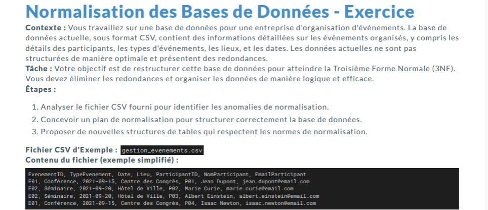

## Modélisation 

**Conception** 

On commence toujours par un MCD avec une shématisaion des entités et des relations. 

ensuite on fait le MLD ou cette fois-ci nos entités et nos relations deviennent des tables uniquement quand c'est des many to many (ex: table prof avec IDprof, nom.. et une autre table : cours ou on retrouve à l'intérieur coursID et la relation qu'on avait dans le MCD devient une table Prof-cours et à l'intérieur on retrouve les deux ID ).

Ensuite avant d'arriver à la base de données , on fini par le MPD qui lui reprend tout mais cette fois ci même les colonnes avec les types, savoir si c'est nullable ou non.... et cette fois ci avec obligatoirement un shémas. 




***Correction*** 

| Participant |
|-------------|
| id          |
| nom         |
| prénom      |
| email       |

| Evenement |
|-----------|
| id        |
| type      |
| date      |

|Lieu            |
|----------------|
| id             |
| salle          |


## Base de données non relationnelle 

Pour une utilisation rapide dans une application par exemple , le mieux est de stocker les données dans la RAM qui est une base de données non relationnelle. 

On utilise une base de données non relationnelle comme REDIS , qui lui va stocker les données dans la RAM en utilisant la notion de clé-valeur. 

Pour utiliser Redis , on telecharge Docker. Docker c'est juste des process, qui permet de faire fonctionner redis, my sql..

Pour installer Docker : On télécharge à partir de notre naviguateur, ensuite si on à l'erreur WSL , on clique sur quit et on lance un powershell en administrateur et à l'intérieur on tape : wsl --shotdown
et on redemarre l'ordinateur et la docker est installer correctement. 

## Commandes pour démarrer Redis dans un conteneur docker 

```bash
docker run -p 6379:6379 -d redis
creer un dossier
npm init 
```
